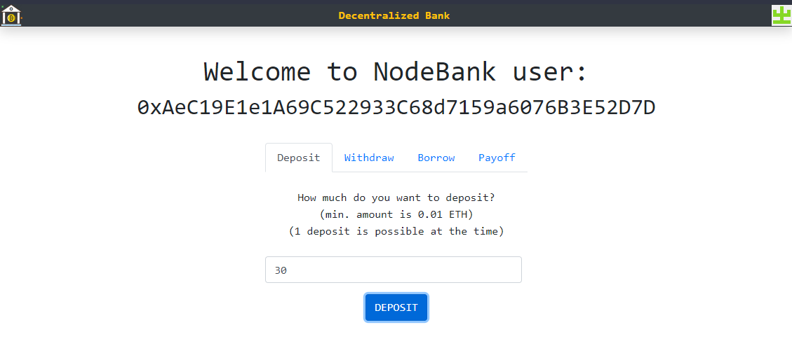

# Decentralized Bank.
A decentralized bank with interests and loans with DEFI Blockchain, Ethereum, Solidity, IRC20 interfaces, truffle, ganache, Web3.js, and React.js

Meant to learn blockchain technologies.

## How to run.

1) Install the following dependencies: Node, truffle, ganache.
2) Make sure your `truffle-config.js` is setted up with your Ganache network.
3) Execute the command: `npm i`
4) Execute the command: `truffle migrate --reset`
5) Execute the command: `npm start`

## Testing.

- Execute the command `truffle test` to run the tests.